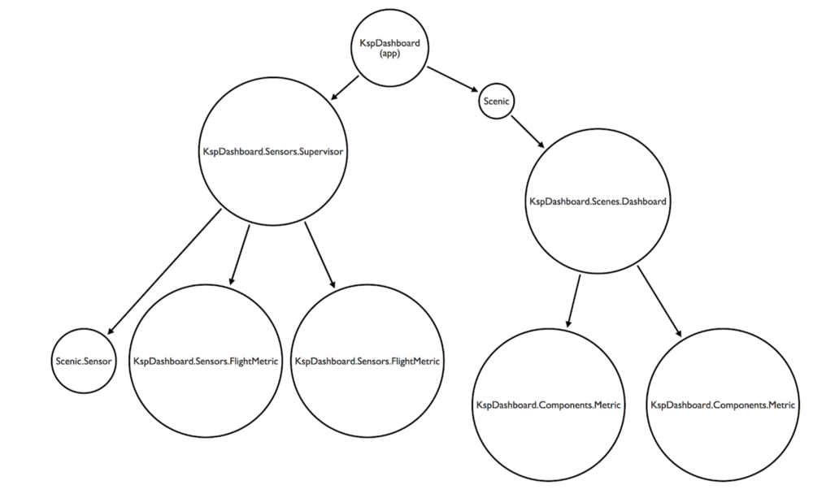

On July 24, 1969 Neil Armstrong and Buzz Aldrin were attempting to land on the moon for the first time in human history. As you might expect it was a tense situation. Of course it was just then that they got what every computer user hates to get… a cryptic error code:

> Neil Armstrong: *PROGRAM ALARM.*
> Mission Control: *It’s looking good to us. Over.*
> Neil Armstrong: *It’s a 1202.*
> Buzz Aldrin: *1202.*
>
> *(14 seconds later…)*
>
> Neil Armstrong: *Give us a reading on the 1202 PROGRAM ALARM.*
> Mission Control: *Roger. We got — We’re GO on that alarm*
>
> *Source: [Apollo 11 — Technical Air-To-Ground Voice Transcription](https://www.hq.nasa.gov/alsj/a11/a11transcript_tec.html)*

Unhelpfully, the error (along with a related 1201 error) continued to pop up in the minutes before landing as Armstrong focused on piloting. As they finally touched down the error was forgotten and they prepared to take their giant leap for mankind. But what was the mysterious error?

## Expecting the Unexpected

Some months back I wanted to give a brief presentation at our local Stockholm Elixir meetup group. As Scenic (a application user interface library) had been recently released it was a perfect opportunity to learn something new while hanging out with other Alchemists. When thinking of what to do with [Scenic](https://github.com/boydm/scenic), I decided that I wanted to integrate with one of my favorite games: Kerbal Space Program. After all, why have only one challenge when you can have two instead?

Kerbal Space Program is a game that gives you a small space center and the opportunity to try rocket science for yourself (be ready for lots of explosions). From the community of its fans we also get the kRPC plugin which allows other programs to interface with the game’s internal APIs using Protocol Buffers. This was just what I needed to implement a Kerbal Space Program dashboard demo.

As part of the Apollo program, the MIT Instrumentation Laboratory was tasked with designing the Apollo Guidance Computer. For that the team exhaustively tested the computer and the mission programs to make sure there would always be capacity. Fortunately the computer was also designed so that if it did exceed capacity it would restart and pick back up where it left off. The 1202 / 1201 errors were indications of this happening.

While you may never build something as important as the Apollo Guidance Computer, users of your software would prefer that it Just Worked. Fortunately with Elixir we are given the tools which allow us to give our users just as seamless of an experience.

In creating my demo I realized that Scenic and Kerbal Space Program would make a great demonstration on how to design for failure in (mock) life-critical situations. Since Scenic uses supervisors for its components it’s designed to fail and recover seamlessly. Perfect to visually demonstrate designing for failure.

## Integrating with Scenic and kRPC

When I researched Elixir solutions to work with kRPC I found the [jooce](https://github.com/FiniteMonkeys/jooce) project. This project had some good example code which I looked through, though when I tried running the code it didn’t work. After quite a lot of struggling I found that it seemed to have been designed for an older version of the kRPC plugin. Because of this I ended up building my own (very simple) interface using [*exprotobuf*](https://github.com/bitwalker/exprotobuf). This worked, more or less, though I needed to use a specific branch of the Erlang *gpb* (Google *Protobuf*) library from CraigCottingham’s fork which fixed a bug I was experiencing.

All of this worked fine and you can see the code [here](https://gitlab.com/cheerfulstoic/ksp_scenic_dashboard/blob/master/lib/krpc.ex), but more recently I found the [space_ex](https://github.com/wisq/space_ex) Elixir library. This probably would have been an ideal solution if I had found it when I was putting together my demo project.

Once I was able to integrate kRPC, I needed to be able to display the dashboard. In Scenic you create a hierarchy of components representing more and more focused parts of your UI. The components are Elixir processes and can receive messages which may change the state of the components and cause the display to be refreshed. I was able to use the [scenic_sensor](https://github.com/boydm/scenic_sensor) library to create another supervised hierarchy of to hold my “sensors”. These sensors would simply send themselves messages to loop every 200 milliseconds at which point they could query the game and then send the latest readings to the Scenic components. The supervision tree looked like this:

When I was first testing this out, my components would flash back and forth. After debugging for a while it I found that while each component would set its own value just fine, the Scenic graph that was being used was always the initial one. Therefore each change reflected only the most recent sensor. Fortunately the fix in my project was easy and a simple PR to the [scenic_new](https://github.com/boydm/scenic_new) project would help prevent others from running into it.

With the UI updating smoothly, I wanted to be able to simulate failure in the system. I decide to start with each component having a 1% chance of failing on every sensor check. With a check every 200 milliseconds and two sensors refreshing, that means that there should be a failure approximately every 10 seconds! That worked well, though when I would try to scale it up I would get a mess of Elixir backtraces that I had a hard time figuring out. After more struggling I realized that I was hitting the retry limits of the supervisors and they were simply giving up. After a simple update of `max_restarts`, I could monitor my sensors without even noticing flickering as things constantly crashed. I was even able to demo it at the meetup!

## Bonus Notes

- I found this [video](https://www.youtube.com/watch?v=Qj2IETkScWA) of somebody simulating the Apollo Guidance Computer to use in my presentation. In includes audio from the astronauts asking about the 1202 alarm
- For those interested in more information, Vintage Space has a good [video](https://www.youtube.com/watch?v=kGD0zEbiDPQ) and [writeup](https://www.discovermagazine.com/the-sciences/apollo-11s-1202-alarm-explained#.W__d35NKh24) about the 1201 / 1202 alarms.
- Aviation Week had an [interview](https://web.archive.org/web/20180505110204/http://aviationweek.com/blog/dragons-radiation-tolerant-design) (Wayback Machine link) with John Muratore at SpaceX discussing how they make radiation-tolerant hardware (which double checks it’s work and restarts as needed)
