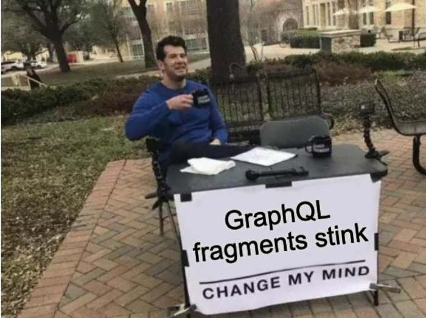
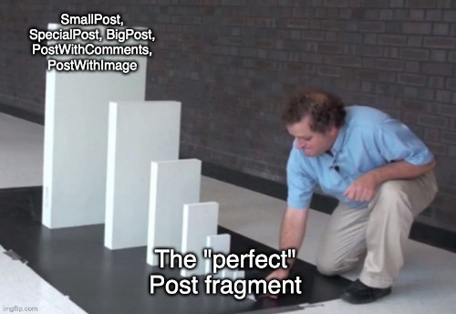

Today, I partially broke Fishbrain’s staging environment. While that largely is the purpose of our staging setup, breaking it isn’t entirely ideal. Doing so might prevent your colleagues from doing their work. During debugging this unexpected situation, it quickly became clear that the issue was because of how we were using GraphQL fragments when loading our posts and our feed.

This made me post this meme on our Slack. It also inspired this blog post, so that we can share some of our learnings.



## Fragments?

Fragments are a part of the GraphQL specification that allows you as a developer to break out parts of your queries into smaller, reusable, chunks. These can be thrown in wherever they are needed in your queries. This is neat, as it can help you reduce the overall footprint of your application and reduce the amount of code. Less code, less surface area for bugs.

To be clear on what we’re talking about, this is what a GraphQL fragment might look like in a query:

```graphql
query GetPost {
  post(id: "abc123") {
    author {
      ...userDetails
    }
    postText
  }
}
fragment userDetails on User {
  firstName
  lastName
  nickname
  isPremium
  countryCode
}
```

Neat. What this code snippet does is to find some kind of post entity, the text that this post contains, and then it finds the author of that this post. The author is of the `User` type, and whenever we want to display an author, we can use this `userDetails` fragment.

For instance, if we want to search for a user, our query might look like this:

```graphql
query FindUser {
  users(search: "fish") {
    edges {
      node {
        ...userDetails
      }
    }
  }
}
```

Here, we don’t need to define the `userDetails` fragment, as we already have done so since before. Great!

By now, I hope that some of the benefits and potential use-cases of fragments are clear. (Or at least more so than before.) Let’s move on to what we learned.

---

## Dos and don’ts

I’m going to try and list what we learned by showing what we did, and what we realized we should be doing instead.

### Fragments for lists

Listing things using GraphQL connections is great. Avoiding repeating code is also great.

**Do:** Use fragments on the `node`. Like this:

```graphql
query FindUser {
  users(search: "fish") {
    edges {
      node {
        ...userDetails
      }
    }
  }
}
```

**Don’t:** Use fragments to get rid of the “boilerplate”.

```graphql
query FindUser {
  users(search: "fish") {
    ...userList
  }
}
fragment userList on UserRecordConnection {
  edges {
    node {
      ...userDetails
    }
  }
}
```

**Why?** As useful it might at first seem, this locks the schema into the naming of the `UserRecordConnection`, as the fragment is tied to this type. It also hides some goodness that GraphQL provides, such as being able to use the potential metadata in edges.

Say you would want to tell the clients why this user was returned for the search. A great place for this is the `edge`, as shown below, as it isn’t related to the `User` type.

```graphql
# Searching for users with search meta data on the edge
query FindUser {
  users(search: "fish") {
    edges {
      score
      matchingTerm
      searchBoosting
      nodes {
        ...userDetails
      }
    }
  }
}
```

If you had relied on the `userList` fragment here, you would then have to extend the `userList` fragment with that metadata. Does the `userList` name make sense now? Or should it be `userSearchList`? Can you reuse that very specific fragment? Or is would it be better to perhaps put the search metadata into a `searchMetaData` fragment?

Today’s staging outage at Fishbrain was caused by this very issue. Due to the release times of Android and iOS apps, we can’t get rid of this now deprecated connection for many months, since it is being used in production by all of our users.

### Combine multiple fragments

**Do:** Use multiple, smaller, fragments to compose your objects in your queries. Lets look at the `GetPost` example again:

```graphql
# Get post with fragment composition
query GetPost {
  post(id: "abc123") {
    author {
      ...userDetails
    }
    postText
    ...postImageDetails
    ...publishingInformation
    ...latestComment
    ...likesInformation
  }
}
```

**Don’t:** Use huge fragments with everything you’d ever wish for.

```graphql
query GetPost {
  post(id: "abc123") {
    ...postInfo
  }
}
fragment postInfo on Post {
  author {
    ...userDetails
  }
  postText
  ...postImageDetails
  ...publishingInformation
  ...latestComment
  ...likesInformation
}
```

**Why?** Getting everything you’ll ever need to display a post, no matter the context might seem great. Your queries get small, and you never need to think about what information you have available in a certain context. *It’s all there, always!*



It all seems great until you decide to no longer show the likes when the post is in a list of posts. It might be getting too cluttered. Ok, fine, we take that out in the view. But you are still fetching the data to show those likes, because you used the `postInformation` fragment that is so good. You then decide to create a new God-like fragment: `smallPostInfo`. It’s leaner, contain less data. All good.

But then you want a third way of displaying your posts. This time, only an excerpt of the text should be used, without the image, comments, and when it was posted, but this time, you *want* the likes information. Should you now introduce a third God-like fragment? No. You should split your fragment up, and compose your query using multiple fragments.

This way, you reduce the amount of data that needs to be transferred, which — to us at Fishbrain — is one of the great promises of GraphQL.

---

Hopefully, this can give you some hints on how to get started with GraphQL fragments, and how to avoid some easy mistakes.
