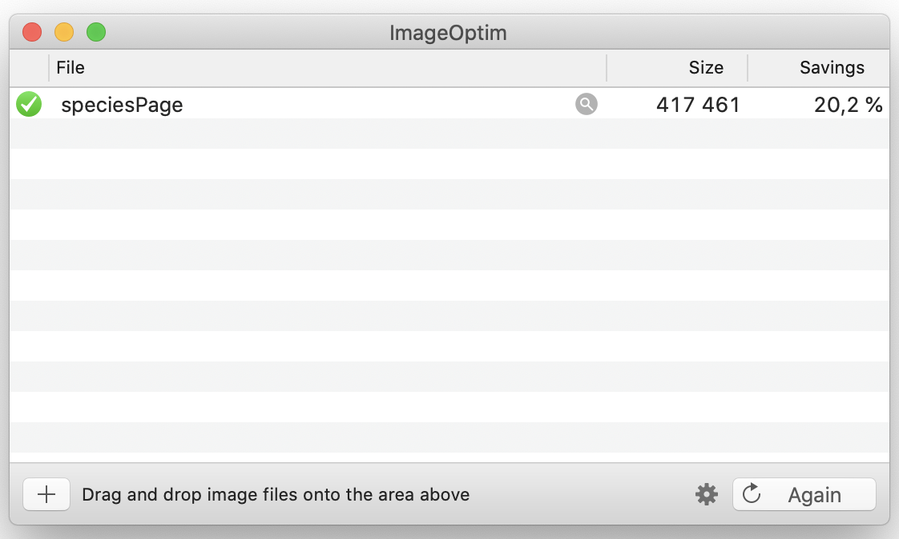

Performance is one of things that we know we should pay attention to as developers, but in practice it can often take a backseat to just getting the thing you're building done. Recently at Fishbrain we redesigned [our Species pages](https://fishbrain.com/species/SCQyR-cP/largemouth-bass). The new version looks great, but when I popped open the network tab in Chrome I was a bit shocked to see that it was transferring over 10mb of data, most of which were images not even visible to the user on initial render.

This article lists a few techniques we used to reduce that payload and provide a better user experience.

## Properly size images

This is usually going to be the quickest win — don't serve images that are larger than a user will ever see them. Most of our images are coming from APIs which provide the ability to define the image dimensions, so that tends to be straightforward (see ["Contentful Image API"](#contentful-image-api) below for more info on that). We also have a handful of static images that we directly serve. For these I just manually resized them using [Squoosh](https://squoosh.app/)

## Losslessly optimise images



"Optimising" the images is another low hanging fruit. Images tend to accumulate metadata and other cruft, so running them through a tool like [ImageOptim](https://imageoptim.com/mac) can lead to some surprisingly large gains.

## Lazy load images

Lazy loading images used to require a finicky Javascript solution, but these days it's part of the HTML specification and [readily available in Chrome, Firefox, and Edge](https://caniuse.com/loading-lazy-attr). All that's needed is to add a `loading` attribute:

```html

```

For unsupported browsers this will be ignored, but there exists polyfills that can enable it for Safari or Internet Explorer.

## Placeholder images

Lazy loading is great for decreasing network payloads, but on a slow connection it can lead to a less than optimal user experience as you may get images popping up unexpectedly on the page. To get around this we implemented placeholder images — low resolution images that can be downloaded initially and displayed until the real image is fetched. Creating a blurred image of <10kb size is easy enough to do in an image editing tool, but the process is pretty labour intensive. Thankfully at Fishbrain we use [Thumbor](https://thumbor.readthedocs.io/) for processing user-created images. Thumbor allows us to append [filters](https://thumbor.readthedocs.io/en/latest/filters.html) to an image URL that will process the image on demand.

With a reduced size image in hand, we can set that as a background on our image element. When our real image loads it will cover up the placeholder image. The code ends up looking something this:

```css
.placeholder {
  background-image: url(/filters:quality(50):blur(50)/species.jpg);
  background-size: cover;
}
```

```html

```

The result is an image like this:


For comparison this is the original image:


## Using WebP & AVIF

We can also make significant reductions in network payload by changing the format of the images we display. WebP is a good option as [it's supported by most modern browsers](https://caniuse.com/webp). And here we can again enlist the help of Thumbor which provides [a format option](https://thumbor.readthedocs.io/en/latest/format.html).

For even larger gains we can use the AVIF format (Jake Archibald has [a great article about the advantages of AVIF](https://jakearchibald.com/2020/avif-has-landed/)). Unfortunately the support here is [only Chrome](https://caniuse.com/avif), but that's still a decent slice of our users covered.

## Contentful Image API

Some images on our page are fetched from a [Contentful](https://www.contentful.com/) CMS instance. Thankfully [Contentful provides an API](https://www.contentful.com/developers/docs/references/images-api/) similar to Thumbor that allows us to resize and reformat our images as needed. It doesn't have a blur capability, which means we can't use placeholder images here, but they do allow reformatting to the Progressive JPEG format, which can have a similar effect.

## Results

Before making these changes our most visited page downloaded 8.4MB of images - regardless of whether you scrolled to view all the images or not. After the changes an initial render would download 963kB of images, with 1.5MB fetched if you scrolled to the end of the page. This should hopefully lead to a much improved user experience!
