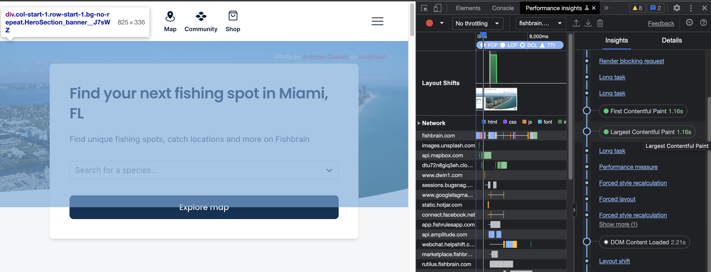
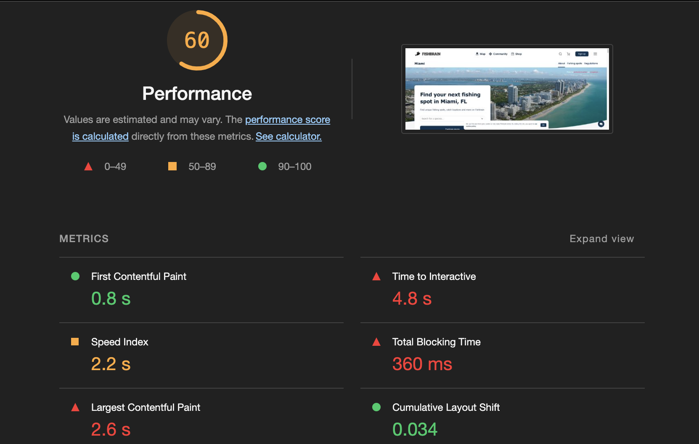
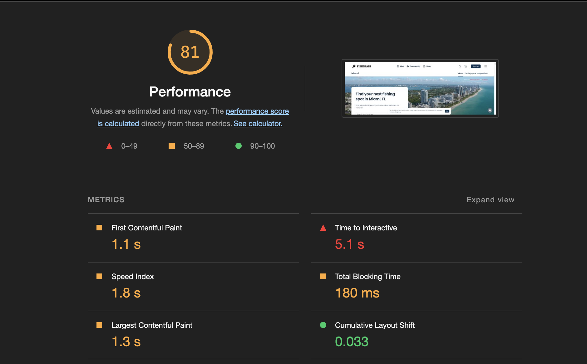

## Are web vitals necessary?

From Google monthly user experience data, between May and October 2021, overall [Core web vitals compliance increased by 58 per cent worldwide](https://www.figmentagency.com/seo/core-web-vitals-seo-updates-for-2022).

- Largest Contentful Paint – 44 per cent compliance
- Cumulative Layout Shift – 71 per cent met requirements
- First Input Delay – 91 per cent compliance

So obviously if you're not optimizing for core web vitals, you are definitely in the minority.

## LCP

In the Fishbrain web application, we're doing fine with the FID and CLS scores as you can see in the title image. But the LCP score is quite hight compared to the standard time (2.5s).


### Identifying the LCP of a page

There are a few ways we can identify the LCP of a page. One easy way is to use the Performance Insights tab in Google Chrome. Once you click the "Measure page load" button it will run for a few seconds and then it will show some details related to performance. On the right side of the tab, you will be able to see web vitals and once you hover LCP it will highlight the LCP content of the page.



### Improve the performance of an image

Once we identify the LCP element of the page, we can try to make sure it loads relatively fast. Since in this case, it's an image, we can load the image in "eager" mode instead of "lazy" mode.

```html

```

Since `eager` is the default value for the loading attribute, in this case we can remove the loading prop as well.

[This Article](/posts/improving-images-on-fishbrain.com) from our blog also explains how we have improved the overall performance of the images.

### Preload the LCP image

Preloading the image inside next/head is another effective way to improve the LCP score.

```jsx
<Head>
  <link rel="preload" href={imageUrl} as="image" />
</Head>
```

This will ask the browser to load the image upfront even before it discovers the image element.

### Next.js Dynamic imports

For testing a single page (url) performance, [web.dev/measure](https://web.dev/measure) is a great tool. After measuring the performance with this tool, it provides us with some useful methods on how to improve our web vitals scores.
One of the methods it suggests is to reduce the initial response time. For this we could use [Next.js dynamic imports](https://nextjs.org/docs/advanced-features/dynamic-import). It's a handy way to load components and libraries only when those are needed. Therefore we could use the dynamic imports when we are loading components conditionally. This will also slightly reduce the build size.

```jsx
const DynamicCatchesSection = dynamic(async () =>
  import("./components/CatchesSection")
);
```

```jsx
<DynamicCatchesSection
  title="This is title"
  regionCode={regionCode}
  slug={slug}
  countryCode={countryCode}
/>
```

### Results

Before:


After:

As you can see, our performance is quite good and the LCP score in particular has improved a lot compared to the earlier version.

**Note:** _The performance is tested in Lighthouse using Desktop mode. Scores can be different from time to time and for mobile devices this score will be considerably lower since the mobile has fewer resources than Desktop devices._

Below are a few more things you can try to improve the overall performance of a Next.js application.

### Next.js image

Next.js also has provide us a good image component (next/image). [Check it out here](https://nextjs.org/docs/api-reference/next/image) They are also experimenting on a new image component - [next/future/image](https://nextjs.org/docs/api-reference/next/future/image) with the help from user's feedback. It will be good to keep an eye on this one since it might help us to improve the performance of the image even more.

### Static & Incremental Static Regeneration (ISR)

Next.js static pages are really important since they will pre-render at build time. We can use static pages by exporting a function called `getStaticProps`. ISR pages in Next.js have also helped us a lot in improving the overall performance of our application. You can read more about it in the [Next.js docs](https://nextjs.org/docs)

### The future of Web Vitals

Google has mentioned earlier that they will be reevaluating Core Web Vitals every year and there has been some indications that **FID** might be replaced with one of items below.

- Responsiveness of all user inputs, rather than just the very first one
- The full duration of the event, rather than just the delay
- Events that happen as part of the same user interaction, together with the entire duration of that process
- An aggregate score for all interactions that happen during the full lifecycle of a web page

I believe it's good to keep an eye on this since it's good to be aware of the changes early to get ahead of the competition.

### References

- https://web.dev/lcp/
- https://nextjs.org/docs
- https://www.figmentagency.com/seo/core-web-vitals-seo-updates-for-2022
- https://web.dev/measure
- https://medium.com/ne-digital/how-to-improve-lcp-and-speed-index-for-next-js-websites-f129ae776835
