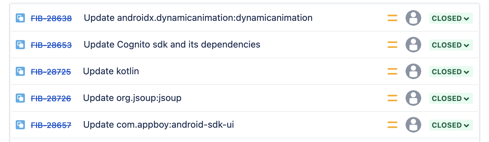
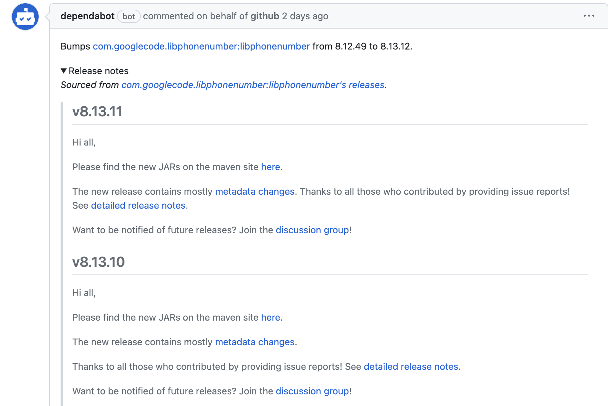

## What we had

Each Gradle module in our project had a list of dependency links. Each dependency consists of a name and a version. The list of dependencies was stored in a special module (buildSrc) that was built first and contained elementary data structures written in Kotlin. This module allowed us to structure and manage the build of the entire application and offered complex composite builds.

```kotlin
object AnalyticsVersions {
    const val play_services_analytics_version = "16.0.8"
    const val adjust_version = "4.33.0"
}

object AnalyticsDeps {
    const val play_services_analytics = "com.google.android.gms:play-services-analytics:${AnalyticsVersions.play_services_analytics_version}"
    const val adjust = "com.adjust.sdk:adjust-android:${AnalyticsVersions.adjust_version}"
}
```

## The problem we were solving

In short, it was about updating dependencies. Unfortunately, the buildSrc module was not supported by Dependabot. I explored several interesting solutions, but they either provided an unstable solution or didn't work.

- [ReleasesHub](https://github.com/dipien/releases-hub-gradle-plugin) supports buildSrc, but it is not stable enough. It also breaks references on versions and requires direct access to the Android repository
- [Gradle Versions Plugin](https://github.com/ben-manes/gradle-versions-plugin) supports buildSrc, but it only gives us information about available updates. We would still need to manually update the dependencies. It has a lot of additional plugins, but autoupdate works only with Version Catalog feature.
- [Renovate](https://github.com/apps/renovate) does not support buildSrc. It is a bot that can update dependencies in the project, but primarily supports Version Catalog or the default build system.

Recently, Dependabot started [supporting](https://github.com/dependabot/dependabot-core/issues/2180) reading dependencies from the buildSrc module, but unfortunately, the solution didn't prove to be effective, so the Fishbrain Android team decided to abandon Dependabot in January this year.

Dependencies updates in the team were handled through a plugin that generated a list using the dependency tree. The team then manually addressed the issues one by one. The update process often took a long time, and there was a problem with the IDE not highlighting the possibility of updating dependencies. This resulted in delayed dependency updates and increased research time. In the context of a small development team, this was critical. The further behind the update, the more accumulated migration changes, making it harder to update later. This created a snowball effect.



## Final solution

With the latest update of the Gradle version, a feature called Version Catalog became available. It is a native method to pass and manage dependencies. Since the buildSrc module was only used for version and naming information, it was evident that both solutions were identical.

[//]: # "Not yaml, but toml is not supported by markdown"
```yaml
[versions]
# analytics
google-analytics = "16.0.8"
[libraries]
# analytics
play-services-analytics = { module = "com.google.android.gms:play-services-analytics", version.ref = "google-analytics" }
[bundles]
# app module bundles
analytics = ["play-services-analytics", "adjust"]
```

As result, how we use dependencies before:
```groovy
    implementation AnalyticsDeps.play_services_analytics
    implementation AnalyticsDeps.adjust
```
And now:
```groovy
    implementation libs.bundles.analytics
```
*It's unwrap to equals line, but simply to manage it*

We also set up a separate repository for migration and testing, which allowed experiments with the same environment, but did not affect any current processes.

## Secondary migrations

During the work, it was necessary to migrate plugin references. In the new model, we also had to move from directly applying plugins in the module-level project file. It's not a big deal, but it's a step forward to the last changes in Gradle Build System. It also helps us to be more flexible in plugin updates.

Before:
```groovy
apply plugin: 'com.android.application'
apply plugin: 'com.google.firebase.crashlytics'
apply plugin: 'kotlin-android'
apply plugin: 'kotlin-parcelize'
apply plugin: 'kotlin-kapt'
apply plugin: "androidx.navigation.safeargs.kotlin"
```

After:
```groovy
plugins {
    alias libs.plugins.android.application
    alias libs.plugins.kotlin.android
    alias libs.plugins.kotlin.kapt
    alias libs.plugins.kotlin.parcelize
    alias libs.plugins.android.safeargs
    alias libs.plugins.crashlytics
}
```

The plugin repositories are now defined in the settings-level Gradle file.
```groovy
pluginManagement {
    repositories {
        google()
        mavenCentral()
        gradlePluginPortal()
    }
}
```

## Outcome

Before:


After:


The build time remained unchanged, which was expected. In the current implementation, several modules and additional operations disappeared. However, we obtained a more modern build system that allows us to be flexible. Most importantly, we added automation and returned Dependabot to our CI/CD. Now we need to think less about dependency updates and searching for changelogs. The bot does the main work, and the programmer only needs to ensure that everything is going well after the dependency update. As a pleasant bonus, the IDE now highlights available versions again.


