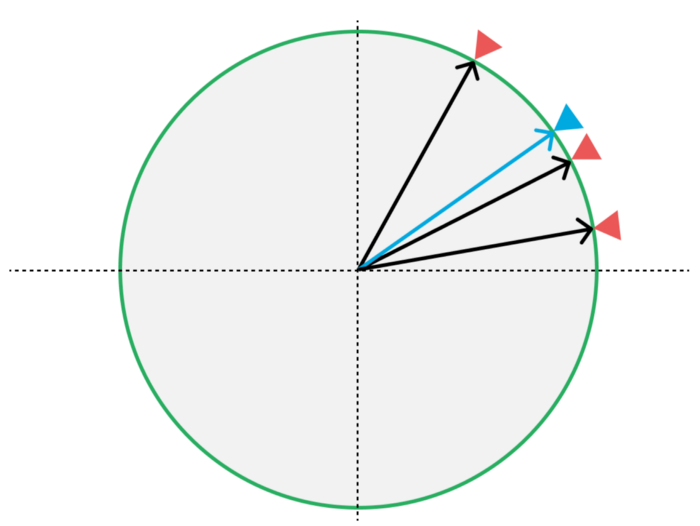

This is a story about one of those times you got to use some of that math they teach you in school.

Recently here at Fishbrain, our team set out to improve how our users’ followings got reflected in their feed. We wanted to generate a feed that feels relevant and ensure that each item in the feed is connected to the their choices and interest.

As fishing is a very location focused sport, one of the sources we wanted to add to the feed was to use the users’ favorite fishing areas. Over the years, Fishbrain as a whole and especially the onboarding experience has evolved. Setting your favorite location wasn’t part of onboarding until a few months back. Before then, users followed waters around the area where they signed up. To move away from this rather clunky behavior, we decided to try and convert these clusters of waters into a circle around a given point. The assumption that this was the user’s true favorite fishing location might not be 100% correct all the time, but our goal was also to give the user control.

One simplistic, but non-working, approach to this is to take the average of the longitude and latitude of the middle point from these waters and use this average as a center point. The radius of the circle would then be the maximum of the distances between the center point and all the other locations.

While seem like a decent approach, it does come with an issue. What happens if the user’s followed locations are located around the [meridian](https://en.wikipedia.org/wiki/Meridian_(geography))? Points at 179.9° and -179.9° longitude are fairly close to each other, but this algorithm would for these numbers result in 0° — far from correct. Averaging on these numbers would then potentially result in our algorithm selecting the opposite side of the earth as that user’s selected area. That wouldn’t do.

Back at the drawing table, we investigated if there wasn’t already a readymade solution for this. Surely, there must be. [Geokit](https://rubygems.org/gems/geokit) is a nice Ruby gem we use frequently already, providing fantastic support for location-based tasks and features within our Ruby on Rails application. It does a lot of things like estimating the distance between two coordinates. The task at hand, however, seemed to be a bit outside of Geokit’s scope.

## Trigonometry Is Cool

The solution we then found might bring up memories from school. Working in trigonometry and calculating angles, length of circular sectors, converting degrees to radians and more.


The approach we decided upon takes a bit more explaining. For the sake of keeping things sane in our examples, we’ll reduce the number of dimensions from three to two. Therefore, a point on a sphere will in our explanation be represented by a point on a circle.



This is what that it might look like. The idea is to, given a collection of points (red), create an averaged, centered point (blue). The first thing we do is to convert these points on the circle to vectors from the center of the circle (the origin). Speaking math, we want to convert our polar coordinates to cartesian coordinates — from coordinates using an angle and a distance, to coordinates using *X* and *Y*.


Looking at one of these vectors, we see the two components it consists of — *X* and *Y*. These components are found by using trigonometric sine functions, based on the angle from the horizontal axis.

*x = r \* cos a*  
*y = r \* sin a*

We normalize the vector so that the total length of the vector equals 1. Once we’ve got these vectors, we calculate the average vector. This is done by summing them component-wise and dividing by the count of vectors, also component-wise. In other words, we want to first find the average position along the *X* axis and the average position along the *Y* axis separately.

This gives us a vector pointing to a pretty accurate estimate of the center point. Thanks to the wrapping nature of sine functions, this works around the meridian too.

## What About Our Sphere-like Globe?


Similarly, but a bit more complicated, this can be done in a three-dimensional coordinate system. Given angles that describe where on a sphere a point is, we can find our point in a 3D vector. In our world, outside of the world of math, these angles are what is usually called latitude and longitude. Our axis pass through the equator and the Greenwich line. We assume the radius is always the same — an approximate of the Earth’s radius, as we don’t need to care about the altitude of the point.

For three dimensions, we then calculate:  
*x = cos(lat) ⋅ cos(lng)*  
*y = cos(lat) ⋅ sin(lng)*  
*z = sin(lat)*  

The same procedure is then applied to these three components. The average point along each axis (X, Y and Z) is calculated and put together to a vector. It is then normalized (so that the length of the vector equals 1) and converted to polar coordinates:

```ruby
def cartesian_to_polar(x:, y:, z:)
  hyp = Math.sqrt(x**2 + y**2)
  {
    lng: Math.atan2(y, x),
    lat: Math.atan2(z, hyp)
  }
end
```

## From Points to Circles

When we got this far, we could calculate an average center point for each user. But for this to work in our feed algorithm, we also needed a radius. The area would then be defined by a point together with a radius, which would form a circle on the surface of the earth. User content within this circle would then be marked as potentially interesting in the feed algorithm.

To find this radius, we turned to the world of math and trigonometry again. This time we used a method called the [haversine formula](https://en.wikipedia.org/wiki/Haversine_formula), or the haversine distance. Given the longitude and latitude of two points, the haversine formula calculates the distance between two points. With our freshly found center point, we calculated the distance from that point to every other point in our users’ clusters. The greatest distance would then be our radius.

---

Starting with a cluster of points around an unknown center, we now have the middle point and a radius that would cover all the given points. The next step was to use this in our feed, but as exciting as that might be, it is a story for another time.

What does this look like in Ruby, you might wonder? Check this Gist out:

```ruby
module FindCenterPoints
  # Find a center point and a radius from a given set of points
  # @param raw_points Array<Hash<lat: number, lng: number>>
  # @returns Hash<lat: number, lng: number>, number
  def calculate(raw_points)
    points = raw_points.map { |p| Point.new(lat: to_radians(p[:lat]), lng: to_radians(p[:lng])) }
    center_point = center_point(points)
    distance = furthest_distance(points, center_point)
    center_point.to_h, distance
  end

  private

  EARTH_RADIUS_KILOMETERS = 6_371

  class Vector
    attr_reader :x, :y, :z

    # https://stackoverflow.com/a/14231286/3592861
    def self.from_point(point)
      new(x: Math.cos(point.lat) * Math.cos(point.lng),
          y: Math.cos(point.lat) * Math.sin(point.lng),
          z: Math.sin(point.lat)).normalize!
    end

    def initialize(x:, y:, z:)
      @x = x
      @y = y
      @z = z
    end

    def normalize!(denominator = length)
      @x /= denominator
      @y /= denominator
      @z /= denominator
      self
    end

    def length
      Math.sqrt(x**2 + y**2 + z**2)
    end

    def to_point
      Point.from_vector(self)
    end

    def add!(other)
      @x += other.x
      @y += other.y
      @z += other.z
      self
    end
  end

  class Point
    attr_reader :lat, :lng

    def self.from_vector(vec)
      hyp = Math.sqrt(vec.x**2 + vec.y**2)
      new(lng: Math.atan2(vec.y, vec.x), lat: Math.atan2(vec.z, hyp))
    end

    def initialize(lat:, lng:)
      @lat = lat
      @lng = lng
    end

    def to_vector
      Vector.from_point(self)
    end

    # Estimate distance in km between this point and `other`
    # http://www.movable-type.co.uk/scripts/latlong.html
    def haversine_distance(other)
      delta_lat = other.lat - lat
      delta_lng = other.lng - lng

      a = Math.sin(delta_lat / 2)**2 + Math.cos(lat) * Math.cos(other.lat) * Math.sin(delta_lng / 2)**2
      c = 2 * Math.atan2(Math.sqrt(a),
                         Math.sqrt(1 - a))
      c * EARTH_RADIUS_KILOMETERS
    end

    def to_h
      { lat: lat, lng: lng }
    end
  end

  # Find center point of several points
  # https://stackoverflow.com/q/6671183/3592861
  def center_point(points)
    sum = points.map(&:to_vector)
                .reduce(Vector.new(x: 0, y: 0, z: 0)) { |summed, vector| summed.add!(vector) }
    center = sum.normalize!(points.size).normalize!
    center.to_point
  end

  # Find distance from center point to furthest point
  def furthest_distance(points, center_point)
    points.map { |point| point.haversine_distance(center_point) }.max
  end

  def to_radians(degrees)
    degrees * Math::PI / 180
  end

  def to_degrees(radians)
    radians * 180 / Math::PI
  end
end
```

---

*Thanks to Emil Bogren.*
