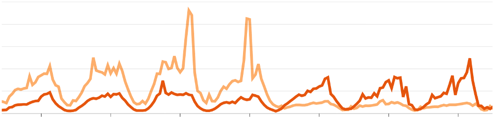

In the backend team at Fishbrain, we care a lot about providing a stable and safe experience when handling our clients’ requests. A natural choice for us a few years back, when we chose to build what is now the core service in our backend setup, was therefore Ruby on Rails. Already then it had gotten less popular, and was losing usage to other languages and frameworks. What, however, we saw was a great opportunity in building a solid (or [SOLID](https://en.wikipedia.org/wiki/SOLID)?) application, backed by easy-to-write and easy-to-run automated tests. And this is where Ruby and Rails thrives. Apart from being backed and used by giants such as GitHub, Shopify, Airbnb and more, it also has a strong community with lots of experience.

?[Running large-scale internet things is hard. Web scale is important.](https://www.youtube.com/embed/b2F-DItXtZs)

These supporters and the community has over the past three years worked hard on making Rails work perfectly as a JSON-only API, suitable to run at *web scale*. Each release tends to come with some goodies that increase the performance of the average Rails application. Because of this, we’re always trying to be as early as possible on each release of Rails. The same goes, of course, for our other dependencies. [Read a bit on how we’re making that easier through Dependabot in our blog post on Automating Code Reviews](https://medium.com/fishbrain/automating-code-review-f9bd2921aaee).

---

Over this past year, we grew out of our database setup. This made the out-of-the-box support for multiple databases and replicas by far the most longed for Rails feature in quite a while. While this theoretically could be solved on a database level with a load balancer and a router (which we — for the record — did run a while back), our current setup did not allow for that. We did experiment a bit with [Makara](https://github.com/taskrabbit/makara), a Ruby Gem that would give us similar features, but with no success.

After deploying Rails 6 with as few changes as possible, we started using some of the new features. A week after the release of Rails 6, we had configured a multiple database setup, so that our Rails app would talk to the read replicas of our primary database. This is what happened:

The lines in the graph above show the CPU load on our database cluster. One line (darker), shows the load on our reading replicas. The lighter one is the single writing database. The graph shows a week’s worth of data, and the traffic clearly shows how the load on our backend services vary over the day. **Just after the fourth day in this graph, the lines cross. This is when we deployed the new database config**. This is a huge win for us, as this allows us to continue feeling safe with our current setup without worrying that expensive database writes would end up blocking connections or causing outages.

Even with the “primitive” automatic HTTP method based connection switching that comes with Rails, we saw huge improvements in how our database performed. As can be seen in the graph, the reading replicas started taking more of the load. As we’re running on AWS Aurora MySQL instances, these instances scale as load increases. While this decrease in the primary writing replica’s load might have been expected, we were pretty surprised how well this setup performed.

After a few bug fixes, where the read replicas were accidentally targeted for writing queries, we’re now looking forward to tuning the connection switching middleware to be even more performant and smart. Also, configuring our MySQL connection setup to react faster to our database’s scaling events is something we’re looking forward to.

---

While support for multiple database connections was just one of several shiny new features, this is what we have been focusing on so far. The latest Rails releases have been pretty great, both from a developer experience, and a performance perspective. Using the now-default Zeitwerk auto loader and “native” parallel tests seems fantastic. As summer nears its end in the northern hemisphere, these are just some of the things we’ll look into next.

Read more on what’s new in Rails 6 in the [official release blog post](https://weblog.rubyonrails.org/2019/8/15/Rails-6-0-final-release/).

---

*Thanks to Luke Hansford*
