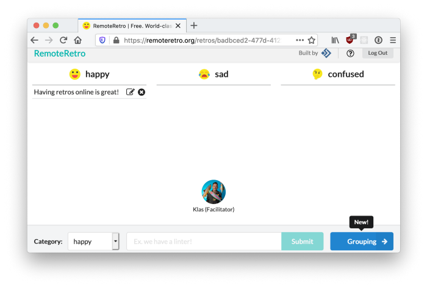
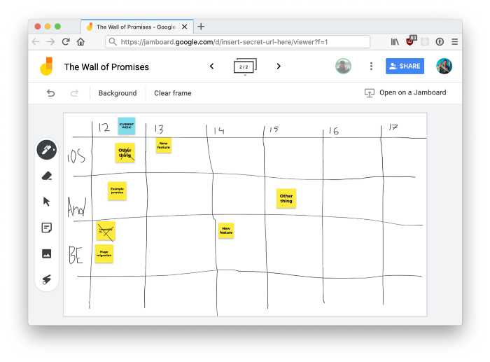

Like many, many other companies, Fishbrain decided to close down the office two weeks ago. This was done as a response to the spreading *SARS-CoV-2* virus and the *COVID-19* disease that comes with it. While some of us are used to the remote lifestyle since before, many are new to this.

In this post, I thought I’d share what my team has been doing to get work done as smooth as possible. You might not find anything here very revolutionizing, I mostly wrote this post to share it with friends and teammates.

## Remote Meetings

Relying 100% on asynchronous communication through Slack, Github or email might be hard. Especially when the remote transition comes quickly without the possibility of easing into it. As we use Google’s Gsuite service, we have Google Meet/Hangouts as a natural option. [Google even announced](https://support.google.com/meet/thread/32228664?hl=en) that the highest tier of advanced features with recorded meetings and a higher limit of number of participants is now included for every organization through July 1st. At Fishbrain, we’ve also previously relied on [Zoom](https://zoom.us/).

For casual or spontaneous syncs, Slack, Apple’s *Facetime* or regular phone calls (😱) cover our needs.

To make some of our meetings feel more fun and friendly, some of us have started using the virtual web camera that [Snap’s Snap Camera](http://snapcamera.snapchat.com/) provides. It has proven to be a great way of making things a bit less stale and to lighten up the mood.

[Shush](https://apps.apple.com/se/app/shush-microphone-manager/id496437906?l=en&mt=12) is a neat Mac app that adds a global push-to-talk mode to your computer. Nice for larger video meetings.

## Retrospectives

I find it important to stick to the team’s routines, even (or rather especially) if the surroundings change. A retrospective meeting is one of those, almost holy, routines I appreciate. We’ve come to rely on the fantastic service RemoteRetro.org. It is so great, that even when in the office that, we tend to use it almost every retro. And it’s free! And [open source](https://github.com/stride-nyc/remote_retro/)!

RemoteRetro allows the team to contribute with topics in a remote and distributed fashion. Everything is synchronized instantaneously to all participants, and it guides you through the process.

See more at [remoteretro.org](https://remoteretro.org/).

## Whiteboards

One of the things my team immediately missed from the office was our “Wall of Promises”. This is a movable whiteboard where we track our goals and shipping dates of the features we build. Split up into rows for our different platforms (Android, backend and iOS), and columns for the weeks, we add post-its for the features and goals we’re contributing to.

This is another case where Gsuite and Google cover our backs, and we found out about this feature from [Thoughtbot’s most recent blog post on remote working](https://thoughtbot.com/blog/remote-tools-and-tips-in-these-remote-times): Google Jamboard. Open Google Drive, tap + *New*, *More* and then *Google Jamboard*.

## Music and background noise

Working from home can sometimes remind you just how deafening silence can be. Playing some non-distractive music like some smooth jazz can be helpful. One of our teammates share this stream with some nice beats, perfect to play in the background:

https://www.youtube.com/embed/5qap5aO4i9A

I’ve also enjoyed having some background noise playing in the background. One great source for that is the website [Noisli.com](https://www.noisli.com/). A nice mix of rain, thunder, and wind is my favorite. It makes it feel like you’re away in a cozy cabin somewhere.

The modular synth artist Colin Benders has also been streaming some live sessions while he is in self isolation. Also perfect to have playing in the background. Tune into his third session below, or find more on his [Youtube channel](https://www.youtube.com/channel/UCx74vAHCehhLOeQNwbJcGyQ).

https://www.youtube.com/embed/r023qzhuoqE

## Remote fika

One of Sweden’s largest cultural exports is probably *fika*. It is a verb and a noun — eating a snack while socializing, or the actual snack itself. With Fishbrain being based in Stockholm, this is something we do from time to time. To keep close to the team, we’ve hosted a couple of online *fika* breaks on Google Meet. It helps us keep close socially, but distancing ourselves physically. Great for reinforcing the team spirit and reminding ourselves that we’re *not* alone, even though it might feel like we are. Just open up a call, share the link with some others and have a snack and a chat.

---

I hope this small collection of suggestions helped you. Let me know if I have forgotten something obvious.

Take care, and stay safe.

*Thanks to Emil Bogren.*
