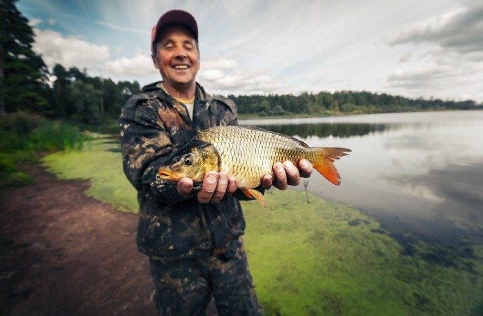

An innovation week at [Fishbrain](http://www.fishbrain.com/) is coming to an end. The theme: “how to push innovation forward to make a better product for the world’s anglers”. A feeling of anticipation and excitement fills the room as the team finish the final touches before demoing their work. An engineer pushes the final line of code as the last slide of their Keynote presentation is completed. The first Fishbrain species recognition model has been born.

## How can we help anglers catch more and bigger fish?

One goal of Fishbrain is to help anglers to catch more and bigger fish. When the users upload their catches, we ask what species it is, among other things. This information can be used by others to understand where fish are caught, which bait to use for different species, and when to go fishing. In addition to user benefit, the data can also be helpful for research and governmental agencies. One example is our collaboration with U.S. Fish and Wildlife Service and the Florida Wildlife Commission where Fishbrain helps track both invasive and endangered species.

The team was certain there were better alternatives for how users could log catches. We felt we could give users a better experience while also improving our data quality. Previously, the user had to sift through different options of popular species. This was tedious work and potentially incorrect species information could end up in our database.

The first proof of concept was created back in early 2015. A fish image was selected and an image recognition model was trained on a Google Cloud instance. In addition to the model, there were also a simple API where one could send images for classification. However, bringing this idea to production would require more work to meet the requirements for speed and accuracy.

The second iteration involved more research around alternative solutions and technologies. One of the technologies we tested was *TensorFlow*. It seemed like a strong fit based on which features it supported as well as general adoption by the community. We also found blog posts describing solutions to problems similar to ours. In addition, it provided the possibility to run our models on different platforms — both on servers and on mobile clients — more or less out of the box.

## Training — pike or not?

One key part of getting good results is to have good data on which to train the model. At Fishbrain, with over 3 million catches uploaded at the time, the quantity of data was not the problem. The challenge was rather the quality of the data.The first experiment mentioned earlier showed that the species label accuracy was not enough, and many users’ catches were mislabeled.

To tackle this, the team started to manually go through the images one by one and label them as verified or not. This was both time consuming and error-prone and involved a lot of manual syncing between the people who participated in the labeling.

To simplify the process, we developed a new tool: a basic web interface that could be used for labeling. In the tool, an “expert” is presented with an image of a fish that a user has labeled with a species, and asked if this the correct species or not. The interface is not very far from the interface of a popular dating app, but with images of fish instead of people.

Bringing species recognition and fish-no-fish to our users

Today, Fishbrain has two different models running in production. We started out with just the species recognition model. Its purpose is to determine the species of a fish present in a photo uploaded by the user. The model is based on [inception-v3](https://arxiv.org/abs/1512.00567). It has a good track record and has been used successfully for solving problems similar to ours. The network was trained both from scratch and using transfer learning on a publicly available model pre-trained with imagenet data. Both returned similar results, but we chose transfer learning as it was much cheaper.

With the species recognition model running as intended, the work on the second use case started — the fish-no-fish model (only partly inspired by [Hotdog-Not-Hotdog](https://medium.com/@timanglade/how-hbos-silicon-valley-built-not-hotdog-with-mobile-tensorflow-keras-react-native-ef03260747f3)). The fish-no-fish model is supposed to tell whether or not there is a fish present in a given image. This would help a user scan the photo collection for photos of fish that can be uploaded. The first implementation was a bit of a hack, using the previously mentioned species recognition with a set accuracy threshold. If the probability of a known species was above the set threshold, it was labeled as an image with a fish. Even though the inception-v3 model performed well for the use case, it was quite slow and had a negative impact on the size of the client apps.

At that time [mobilenet-v1](https://arxiv.org/abs/1704.04861) was published. It had a smaller network and was designed for mobile, so we decided to use that for the fish-no-fish model. The new model had vastly better performance on the apps and it gave the opportunity to process even more images without sacrificing user privacy. However, having two models on-device increased the bundle size of the apps too much and to save space, we moved the species recognition model to the cloud. For hosting the model, we use the off-the-shelf software package *TensorFlow Serving* installed on cluster of virtual machines on AWS.

## Future work on the Fishbrain species recognition model

The species recognition model in use today contains around 80 species, including the most popular species in the US and northern Europe. But Fishbrain has users all over the world and the ambition is to make it useful for all of them. For that to happen, more images need to be expert-verified and that cannot be done without more experts involved. It would be really interesting to see if the fishing community could help in this task.

The model is under constant development. We’re [working closely](https://ai.googleblog.com/2018/05/custom-on-device-ml-models.html) with Google and the TensorFlow team to increase its speed, decrease the model size, and improve its accuracy.

One idea is to include more information to further improve the model. There are many species with similar features, but they might live in distinct geographical areas. They can also live in different kinds of waters, such as oceans or lakes. Future versions of the species recognition will most likely try to incorporate these facts as well to increase its accuracy and relevancy for all our users.

It’s safe to say that we have only scratched the surface of what machine learning in general and TensorFlow in particular can do for us as a company and for our end users. There is a lot of work that can be done in this area, both in improving our current solutions as well as future use cases. But at least we have taken a first step in the right direction.

Credit to the TensorFlow team at Google, and in particular Pete Warden for his extensive blog post. Also, *data is key*.

---

*Thanks to Klas Eskilson.*
